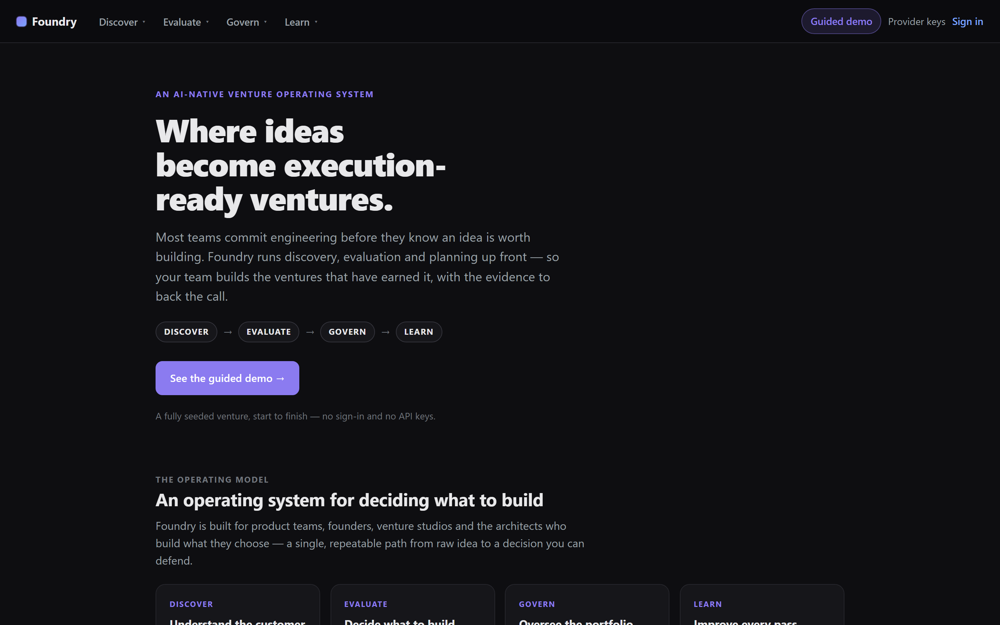
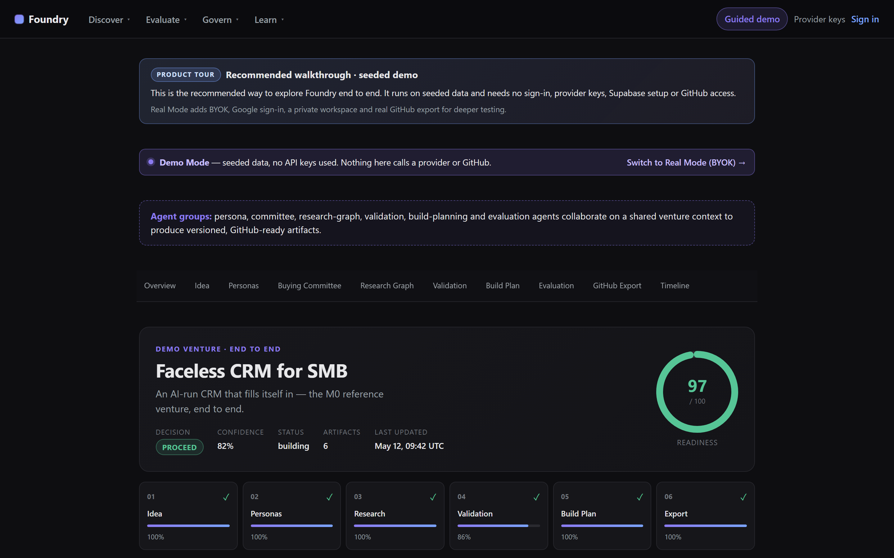
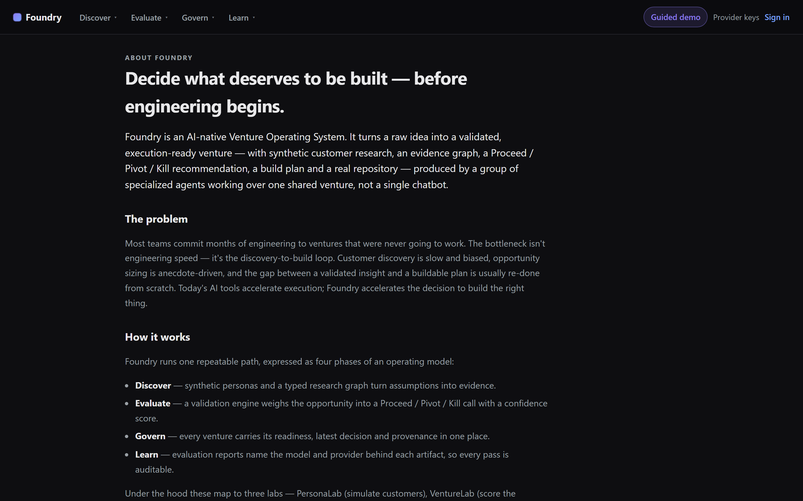
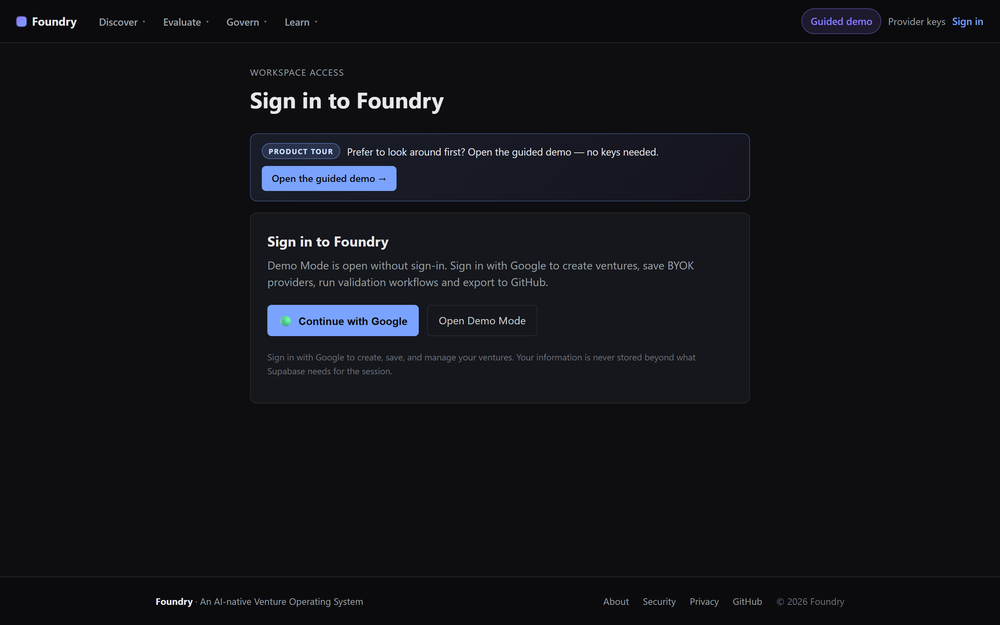

# Foundry

[](https://ventureos-dun.vercel.app/demo/faceless-crm)
[](https://ventureos-dun.vercel.app/signin)
[](#license)

> **An AI-native Venture Operating System that helps teams decide what deserves to be built before engineering begins.** Foundry turns raw ideas into validated, execution-ready ventures using collaborative AI agents — not a single chatbot.

> _Foundry was originally developed and submitted as **VentureOS** for the Microsoft Build AI / HackerEarth challenge. It was renamed as the product evolved beyond the original submission._

**▶ See the guided demo (no sign-in, no keys):** [ventureos-dun.vercel.app/demo/faceless-crm](https://ventureos-dun.vercel.app/demo/faceless-crm) — a fully seeded "Faceless CRM for SMB" venture taken from idea to build-ready.

---

## The problem

Most teams commit months of engineering to ventures that were never going to work. The bottleneck isn't engineering speed — it's the **discovery-to-build loop**:

- Customer discovery is slow, biased, and rarely run against an honest objection set.
- Opportunity sizing is anecdote-driven; "go / pivot / kill" is decided on vibes.
- The gap between a validated insight and a buildable plan is huge and usually re-done from scratch.
- Nobody can tell you *which model produced this paragraph, when, and on what evidence*.

Today's AI tools accelerate **execution** (Copilot, Cursor). Foundry accelerates **the decision to build the right thing** — the deliberation layer in front of your IDE.

## Why Foundry

Most "AI for product" tools generate documents. Foundry instead **runs the decision** you'd want to make before building:

- A **buying committee** of synthetic buyers, ops, finance and economic buyers actually *deliberates* about your offer and surfaces objections.
- Research becomes a **typed graph** of problems, customers, competitors, risks and contradictions — not a wall of bullet points.
- A validation engine issues a **Proceed / Pivot / Kill** recommendation with an explicit confidence score and its reasoning.
- Every artifact records the **model and provider** behind it, so a decision can be traced back to its evidence.

## Operating model

Foundry expresses one repeatable path as four phases — the mental model of an operating system for building ventures:

| Phase | What happens |
|---|---|
| **Discover** | Synthetic personas and a typed research graph turn assumptions into evidence. |
| **Evaluate** | A validation engine weighs problem strength, urgency, willingness to pay and execution risk into a Proceed / Pivot / Kill call. |
| **Govern** | Every venture carries its readiness, latest decision and provenance in one place — nothing advances to build on a hunch. |
| **Learn** | Evaluation reports name the model and provider behind each artifact, turning every venture into a repeatable, auditable record. |

Under the hood these map to three labs — **PersonaLab** (simulate customers), **VentureLab** (score the opportunity), and **BuildSquad** (produce PRD · architecture · roadmap · repository).

## How it works

```
Idea Intake  →  PersonaLab  →  Buying Committee  →  Research Graph
            →  VentureLab   →  BuildSquad        →  Evaluation
            →  GitHub Export
```

Each step is a **VentureJob** that produces a typed, versioned artifact attached to the parent Venture. The next step reads only those artifacts — never raw prompts.

| Step | Agent role | Artifact | Signal |
|---|---|---|---|
| Idea Intake | Brief capture | Venture record | Scope captured |
| PersonaLab | Synthetic customer simulation | Persona set + interviews | Persona coverage |
| Buying Committee | Multi-persona deliberation | Committee transcript + consensus | Objections · opinion changes · confidence |
| Research Graph | Evidence mapping | Problem / customer / competitor graph | Contradictions and key concepts |
| VentureLab | Venture decision engine | Proceed / Pivot / Kill recommendation | Confidence score |
| BuildSquad | Planning agent group (PM/UX/Arch/Eng/QA/GTM) | PRD · architecture · roadmap · stories | Build readiness |
| Evaluation | Quality & provenance agent | `EVALUATION_REPORT.md` | Readiness + risk coverage |
| GitHub Export | Execution handoff agent | GitHub repo (14 files) | Repo URL + short commit SHA |

See **[docs/agent-swarms.md](docs/agent-swarms.md)** for how each agent group collaborates, and **[docs/architecture-overview.md](docs/architecture-overview.md)** for the contracts and execution model.

## Architecture

Foundry is a **TypeScript-first monorepo** (pnpm + turbo) with a strict five-plane layout — Experience, Orchestration, Lab, Provider, Persistence. Every lab is a pure package (`@foundry/personalab`, `@foundry/venturelab`, `@foundry/buildsquad`, `@foundry/research-graph`) that consumes and produces JSON contracts from `@foundry/contracts`. Long-running work runs as a `VentureJob` so the UI always sees status / progress / provider · model · cost / elapsed / failure guidance. Provider SDKs (OpenAI, Anthropic, Gemini, Azure OpenAI, Octokit) live only in their named adapter packages, enforced by a custom `lint:arch` check.

For the full architecture, see **[docs/architecture-overview.md](docs/architecture-overview.md)**. For the internal Sprint −1 design doc, see [docs/architecture.md](docs/architecture.md).

## Capabilities

- **Multi-provider LLM routing** through adapter packages in `packages/providers/*` (OpenAI · Anthropic · Gemini · Azure OpenAI). All BYOK.
- **Persona simulation.** PersonaLab generates and runs a buying committee that deliberates and changes positions; a Python TinyTroupe adapter is scaffolded in `packages/adapters/tinytroupe-py/` for future runtime integration.
- **Research-graph workflows.** `@foundry/research-graph` produces typed graphs of problems, segments, competitors and risks, surfacing contradictions and the highest-leverage **key concepts**; Graphify adapters are scaffolded in `packages/adapters/graphify-*/`.
- **BuildSquad planning** in `packages/buildsquad` — PM, UX, architecture, engineering, QA and GTM agents producing a 14-file GitHub-ready scaffold via the deterministic `renderRepoScaffold`.
- **GitHub export** via `packages/adapters/github-ts/` (Octokit, isolated by the `lint:arch` check).

> **Naming note:** the canonical runtime today is TypeScript. We don't claim full Python TinyTroupe / Graphify parity at runtime — the adapters exist as integration seams for the deferred Python path.

## Screenshots

Canonical, Foundry-branded captures from the live Release 1.0 UI at **[ventureos-dun.vercel.app](https://ventureos-dun.vercel.app)**.

**Landing — the operating model**



**Guided demo — a full venture, end to end.** The seeded *Faceless CRM for SMB* walkthrough runs the entire Discover → Evaluate → Govern → Learn pipeline with no sign-in, provider keys, or GitHub access.



**About — how the operating model fits together**



**Open sign-in.** Demo Mode is public; Google sign-in unlocks private ventures, saved BYOK providers, validation runs, and GitHub export.



More captures — [demo index](docs/screenshots/demo.png), [security](docs/screenshots/security.png), and [privacy](docs/screenshots/privacy.png) — live in [docs/screenshots/](docs/screenshots/). Earlier screenshots captured under the original **VentureOS** branding are preserved as historical artifacts in [docs/archive/ventureos-submission/screenshots/](docs/archive/ventureos-submission/screenshots/).

## Demo Mode (no keys)

Foundry ships a fully seeded **Demo Mode** so reviewers and teammates can experience the full pipeline without any API keys, Supabase, GitHub PAT, or provider calls.

- **URL:** `/demo/faceless-crm`
- **Scenario:** "Faceless CRM for SMB" — an opinionated SMB sales-ops product.
- **What's seeded:** Venture, personas, buying-committee deliberation, research graph, VentureLab recommendation, BuildSquad pack, evaluation report, simulated GitHub export, timeline.
- **Banner:** every demo page is labelled `Demo Mode — seeded data, no API keys used`, so it can never be confused with Real Mode.

Demo Mode reuses the **same renderers** as Real Mode — what you see is what your Real-Mode venture would look like. See **[docs/demo-mode.md](docs/demo-mode.md)** and **[docs/demo-script.md](docs/demo-script.md)** for guided walkthroughs.

## Running locally

Prerequisites:

- Node.js `>=20` (project tested on Node 24)
- pnpm `>=9` (via `corepack enable`)

```powershell
corepack pnpm install
corepack pnpm --filter "@foundry/web" dev
```

The web app runs at `http://localhost:3000` (or `3100` if 3000 is busy). You can open `/demo/faceless-crm` immediately — Demo Mode needs no environment variables. For Real Mode setup (Supabase, encryption key, BYOK), see **[docs/setup-local.md](docs/setup-local.md)**.

**Quality gates:**

```powershell
corepack pnpm run lint
corepack pnpm run lint:arch
corepack pnpm run typecheck
corepack pnpm run test
corepack pnpm run build
```

## Real Mode (BYOK)

Bring your own keys to run the pipeline on your own idea. There are three ways in:

- **Sign in with Google** (recommended for shared deployments) — `/signin` → **Continue with Google**. Each user gets a **private** workspace. Optionally restrict sign-in via `VENTUREOS_ALLOWED_EMAILS` (see [docs/deployment.md](docs/deployment.md#google-sign-in-supabase-auth-shared-deployments)).
- **Alpha Workspace** (shared fallback) — `/access` → **Continue to Alpha Workspace** (requires `VENTUREOS_ALPHA_ACCESS=true`). A shared `alpha-user` identity — fine for personal demos, not for multiple unrelated testers.
- **Local dev** — seed the `vos_dev_user` cookie locally (see [docs/setup-local.md](docs/setup-local.md)); honoured only when `NODE_ENV !== 'production'`.

Then: `/settings/byok` (add an LLM key + GitHub PAT) → `/ventures/new` (create a Venture) → run the labs in order → generate the Evaluation Report → preview and push the GitHub export. See **[docs/security-byok.md](docs/security-byok.md)** for the BYOK model.

**Supported providers & models.** Foundry works across OpenAI (GPT-4o / GPT-4.1 families and the GPT-5 / o-series reasoning models), Anthropic (Claude 4.x), Google Gemini (2.x) and Azure OpenAI — all BYOK. Recommended first-choice models are **GPT-4o mini**, **GPT-4.1**, and **Claude Sonnet**. Selecting an unvalidated model returns clear guidance rather than a raw provider error. See the full **[model compatibility matrix](docs/model-compatibility.md)** for per-model support, testing status, and known limitations.

## Security

- BYOK secrets are **server-side only** and never exposed to the browser.
- Secrets are **encrypted at rest** with `VENTUREOS_CREDENTIAL_ENCRYPTION_KEY` and shown in the UI only as masked values.
- GitHub exports never include `.env`, tokens or credentials — a dedicated test asserts no `ghp_…` shapes ever appear in exported files.
- `.env*` is git-ignored. Import boundaries (`lint:arch`) prevent app and lab code from importing provider SDKs directly.

See **[docs/security-byok.md](docs/security-byok.md)** and **[docs/security.md](docs/security.md)**.

## Roadmap

Where Foundry is headed — near-term hardening and the deeper Python persona/graph integration — is tracked in **[docs/product-roadmap.md](docs/product-roadmap.md)**.

## Vision

The longer arc — an AI-native operating system for deciding what deserves to be built — is described in **[docs/vision.md](docs/vision.md)**.

## Documentation

- **[Product overview (start here)](docs/product.md)** — what Foundry is, who it's for, why it's different
- [Architecture overview](docs/architecture-overview.md) · [Agent design](docs/agent-swarms.md)
- [BYOK & security](docs/security-byok.md) · [Security architecture](docs/security.md)
- [Model compatibility matrix](docs/model-compatibility.md) — supported providers & models, testing status, limitations
- [Demo Mode](docs/demo-mode.md) · [Demo script (3 / 5 / 7 min)](docs/demo-script.md)
- [Deployment](docs/deployment.md) · [Local setup](docs/setup-local.md)
- [Vision](docs/vision.md) · [Product roadmap](docs/product-roadmap.md) · [Repository structure](docs/repository-structure.md)
- [Known limitations](docs/known-limitations.md) · [E2E test plan](docs/e2e-test-plan.md)

## Project history

Foundry was originally developed and submitted as **VentureOS** for the **Microsoft Build AI / HackerEarth** challenge, and renamed as the product matured. The original submission materials are preserved, unchanged, as historical artifacts:

- **[Submission deck (PDF)](docs/archive/ventureos-submission/VentureOS-Submission-Deck.pdf)** — the original 10-slide VentureOS deck
- **[Live-app screenshots](docs/archive/ventureos-submission/screenshots/)** — dated captures of the original VentureOS UI
- **[Long-form write-up](docs/hackathon-submission.md)** and the **[submission pack](docs/hackathon/README.md)**

The seeded demo remains the fastest way to review the product end-to-end: <https://ventureos-dun.vercel.app/demo/faceless-crm> (no sign-in, no keys).

## Team

Built by **Amit Pandey** ([@amit1858](https://github.com/amit1858)), with GitHub Copilot as a pair-programming partner.

## License

Research / hackathon project. License TBD. Do not redistribute production credentials or seeded customer data without permission.
